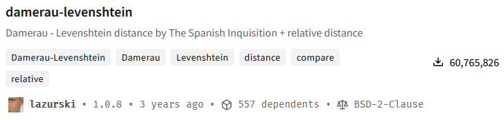
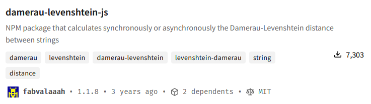
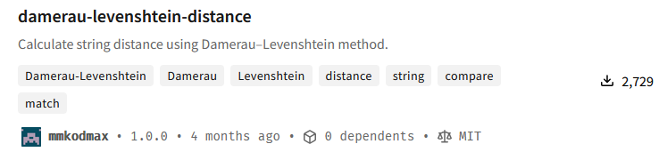
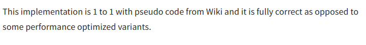

Call me lazy, but when I'm prototyping something. I want to just be able to `<script src="` a library quickly. I don't want to `npm`, `webpack` or any such nonsense, if I'm just quickly winging it. Now most of the time it's wonderful, I can just find a url from jsdelivr or some other CDN that has been minified and ready to be sourced. But sometimes you can't. This is one of those times.

It all started out with trying to find a Damerau-Levenshtein to use in my project to do some perfect fuzzy finding. And NO, I do not want to use fuse.js. I don't need that much crap. I just need a Damerau-Levenshtein algorithm. Surely one is available easily? Let's try to find one on npm.



Tried it from jsdelivr. No browser export. So It doesn't work with `script src`. Also it's crap:
```typescript
import levenshtein from 'damerau-levenshtein';
const lev = levenshtein('CA', 'ABC');
console.log(lev);
```
Ouput:
```json
{ steps: 3, relative: 1, similarity: 0 }
```

Quote from [github issue](https://github.com/tad-lispy/node-damerau-levenshtein/issues/21):
>Suppose I want to get the distance from CA to ABC. Clearly, the answer is 2: CA -> (transposition) AC -> (insert) ABC. But the package says it was 3 steps: { steps: 3, relative: 1, similarity: 0 }

I do however like it gives the `relative` and `similarity` values. A lot of Damerau-Levenshtein scripts just give me the `distance`. Do they not know we might want to do some fuzzy finding?!

Let's try the next one:



What the H-E-double-hockeysticks is this. No browser version and it only has the distance. It's supposed to be the second most popular. And I tested it, it also gives the wrong answer! The heck?! Consumers don't care about anything. They just npm install stuff and LGTM and these are the popular ones? Ok. What's next?



Hopefully this will be better. At least the algorithm should be correct according to the description:



No browser export. But I tested the with node.js and at least it returns the correct amount of steps.

Hmm... The javascript looks simple enough on the [non-minified version of jsdelivr](https://cdn.jsdelivr.net/npm/damerau-levenshtein-distance@1.0.0/lib/calculateStringDistance.js). I wonder if I can implement a better version that can be just sourced from the browser. Done. Doesn't return `relative` or `similarity`. I wonder if that's hard to do? Let's look at [tad-lispy/node-damerau-levenshtein implementation](https://github.com/tad-lispy/node-damerau-levenshtein/blob/master/index.js)

```javascript
   var length = Math.max(thisLength, thatLength)
    var relative = length === 0
      ? 0
      : (steps / length);
    var similarity = 1 - relative
    return {
      steps: steps,
      relative: relative,
      similarity: similarity
    };
```

Oh, that's simple. I can do that. Done. What should we name our function? Something short. The whole point was not to waste too much time. Let's call it `dam(str1, str2);`. What's next. What should we name the repo. `real-damerau-levenshtein` of course. Push it to npm? No way, this is for browsers. Just let jsdelivr do it's magic an minify it to the masses.

So here you go:
```html
<script src="https://cdn.jsdelivr.net/gh/nake89/real-damerau-levenshtein/dist/browser.min.js"></script>
```

You're mighty welcome! With the steps, relatives and similarities alike!

Usage:
```javascript
const result = dam("CA", "ABC");
```

And yes, it returns the correct dang result!
